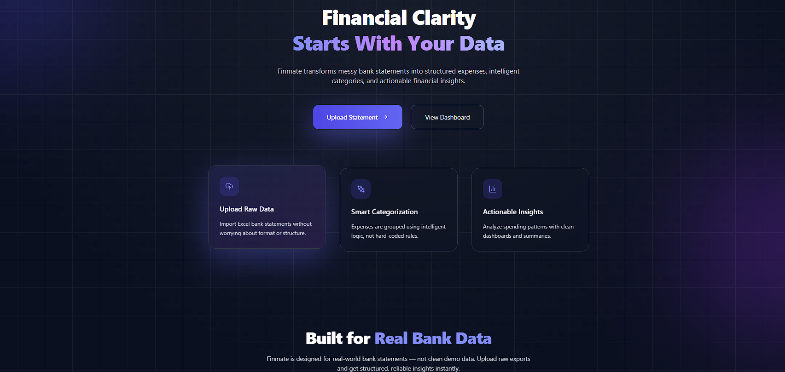
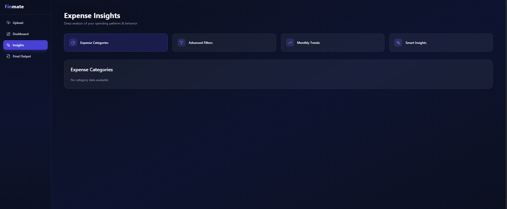

# 💰 FinMate – Smart Expense Analyzer

FinMate is a full-stack expense analysis application that allows users to upload bank statements (Excel files), analyze spending patterns, apply advanced filters, view monthly trends, and generate AI-powered smart insights.

---

## 🚀 Features

### ✅ Upload & Processing
- Upload bank statement Excel files (`.xlsx`, `.xls`)
- Automatic parsing and validation
- Secure storage in MySQL
- Duplicate-safe insertion

### 📊 Expense Analysis
- Expense categorization
- Category-wise totals
- Payment method analysis
- Merchant-wise spending

### 🔎 Advanced Filters
- Filter expenses by:
  - Date range
  - Amount range
  - Payment method
  - Recipient
- View **full transaction-level data**

### 📈 Monthly Trends
- Month-wise expense aggregation
- Ready for charts & analytics

### 🤖 Smart Insights (AI)
- Uses **Hugging Face free LLM**
- Generates human-readable spending insights
- Highlights:
  - Spending concentration
  - Top merchants
  - Behavioral patterns

---

## 🧠 Tech Stack

### Frontend
- React + TypeScript
- Tailwind CSS
- Context API
- React Dropzone

### Backend
- FastAPI
- Pandas
- MySQL
- Hugging Face Inference API

---
### Running the Project

### Backend
cd backend
pip install -r requirements.txt
uvicorn app:app --reload

### Frontend
cd frontend
npm install
npm run dev

Frontend runs on:

http://localhost:5173

Backend runs on:

http://localhost:8000

